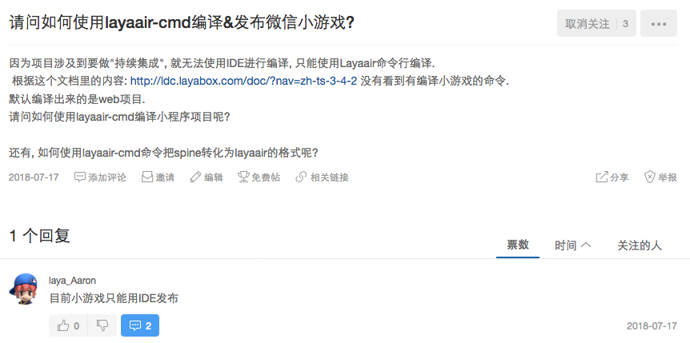

# 使用 Parcel 进行 Layaair 的游戏开发

[English Document](./README.md)

> 打包使用了 Parcel 和 [parcel-plugin-change-file](https://github.com/ymzuiku/parcel-plugin-change-file)

## 缘起

2018年7月,在 `layabox.com` 的论坛上,我的提问.



如图, 论坛管理员并没给解决方案, 也没有说明何时会有解决方案.

介于对WebGL的看好, 和对国产引擎的支持, 有了这个 cli.

实现方式很简单, 仅仅是使用了 parcel 进行二次打包处理, 并且把 `微信小游戏` 所需要的文件配置好位置.

由于 parcel 官方的配置较弱, 所以编写了 `parcel-plugin-change-file` 插件配合使用.

为什么不用 `webpack` 而使用 `parcel` ? `parcel` 编译速度更快, 使用 `parcel` 不用为 `javascript` 和 `typescript` 分别配置一遍, 业余时间毕竟很珍贵 :)

确保你的环境已经配置好 `nodejs` 和 `yarn`, 然后使用下文的几条命令开始你的项目吧.

## :fire: 功能

- 开发过程热更新, 实时刷新游戏界面, 包括H5和微信小游戏
- 使用命令行编译你的微信小游戏
- 使用你习惯的任何IDE进行开发
- 首次使用预先打包core文件, 平时开发只要打包自己项目的代码, 使得打包速度有了数量级的提升


## :egg: 安装 

```sh
$ npm install -g laya-three-cli
```

## :package: 创建项目

```sh
$ laya-three-cli your-project
```

## :rocket: 启动 H5 游戏

```
$ yarn install
$ yarn start
```
And, open `http://127.0.0.1:1234`

## :rocket: 启动微信小游戏

```sh
$ yarn install
$ yarn wechat
```

然后使用 `微信开发者工具` 打开 `dev-wechat` 目录

## :wrench: 升级 LayaAir

LayaAir 并没有把源码放到 npmjs.com 上,并且在 Github.com 上的源码也不是最新的,所以你只能手动去官网下载,并且手动更新:

- 打开 [LayaAir Web](https://ldc.layabox.com/layadownload/?type=layaair-LayaAir%201.7.19.1%20beta) , 并且下载源码
- 拷贝 `lib`, 覆盖你项目中的 `bin/libs`
- 编译新的core.js `$ yarn core`

## :see_no_evil: 最后

如果你在使用中有更好的改进建议, 欢迎到[laya-three-cli](https://github.com/ymzuiku/laya-three-cli) 提交你的PR, 或是赏赐一个星星.